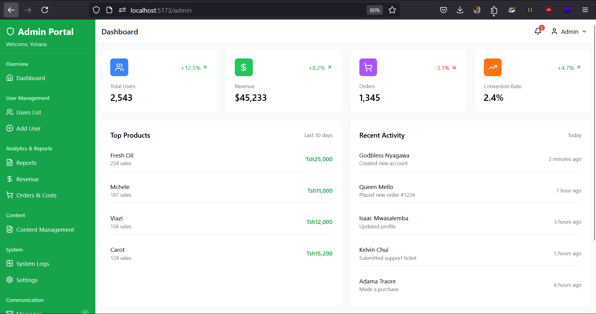
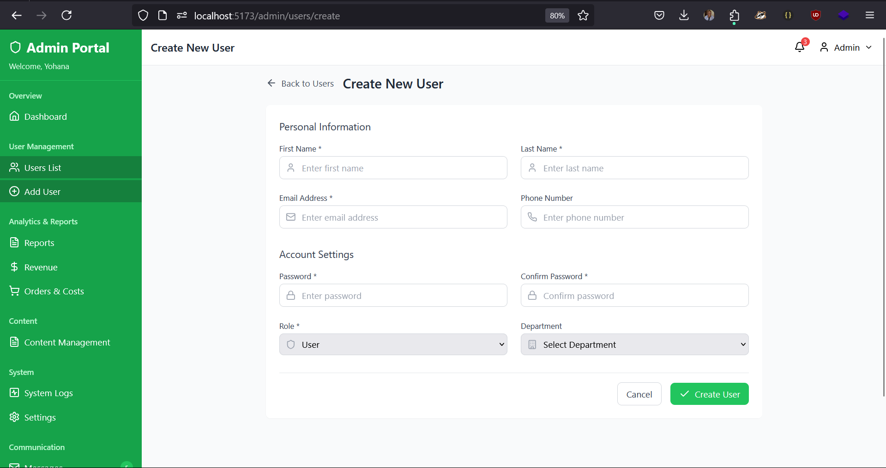
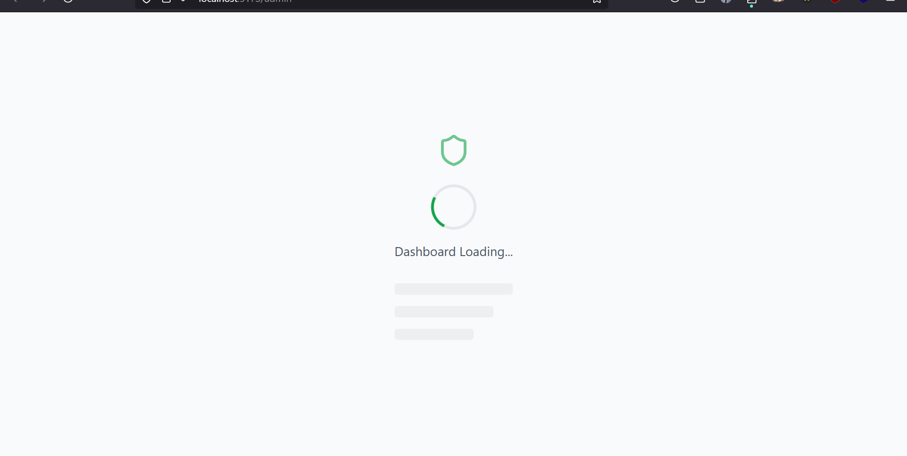
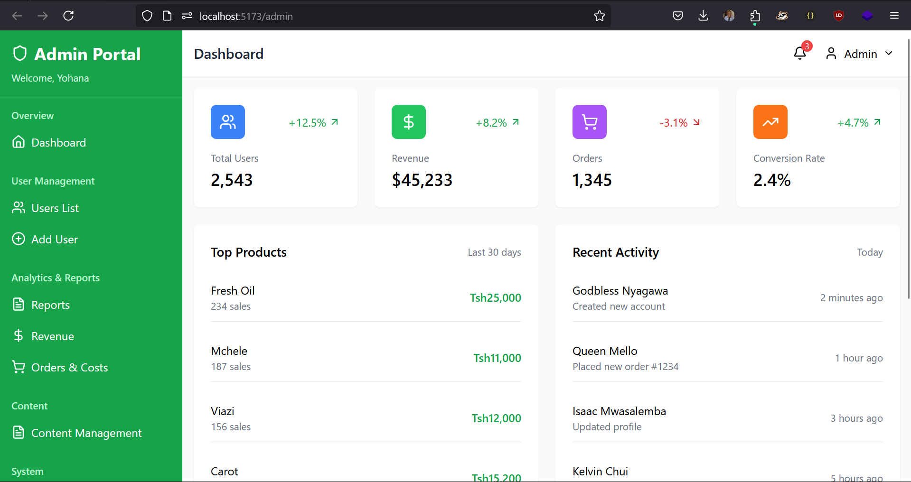
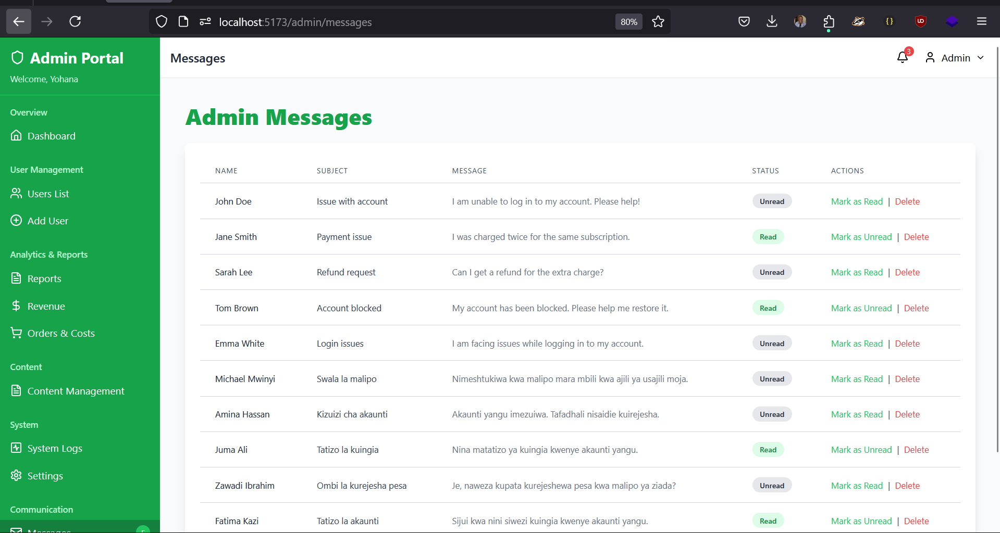
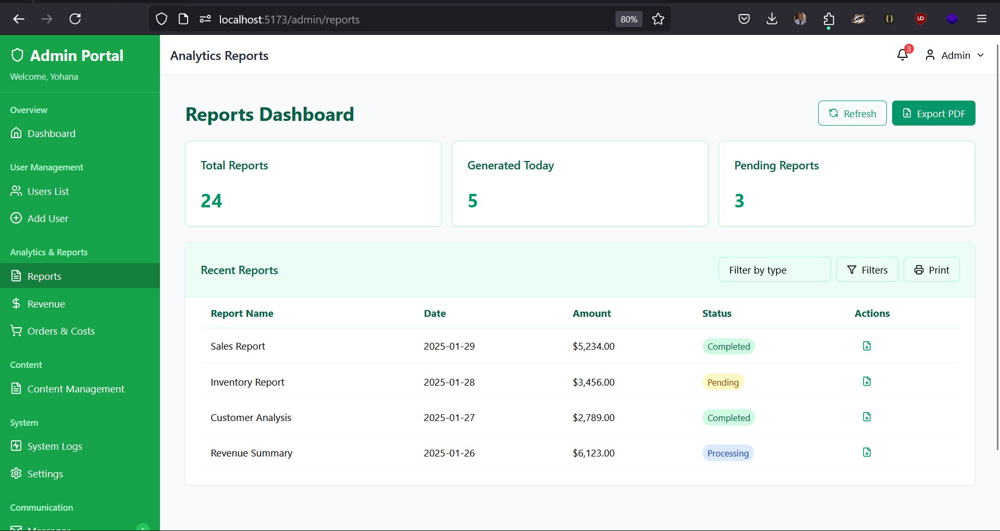
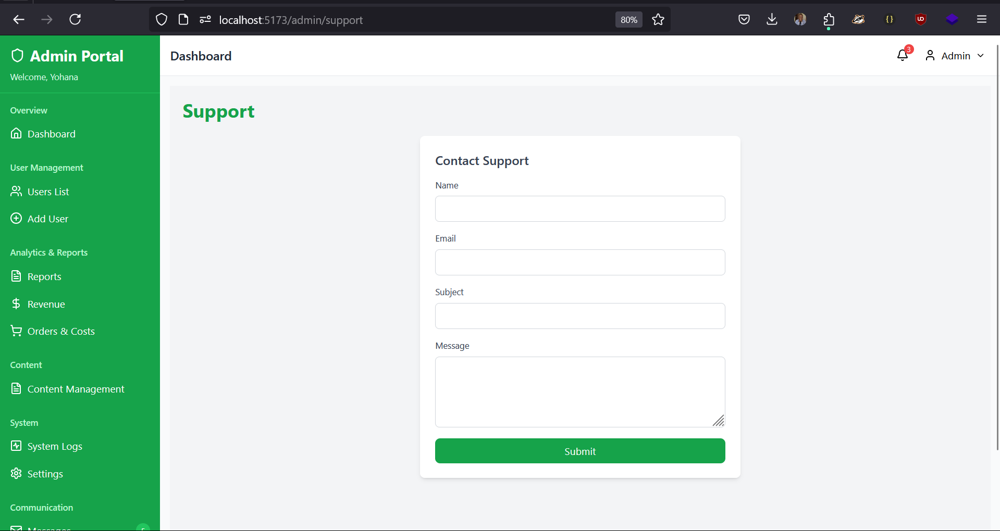
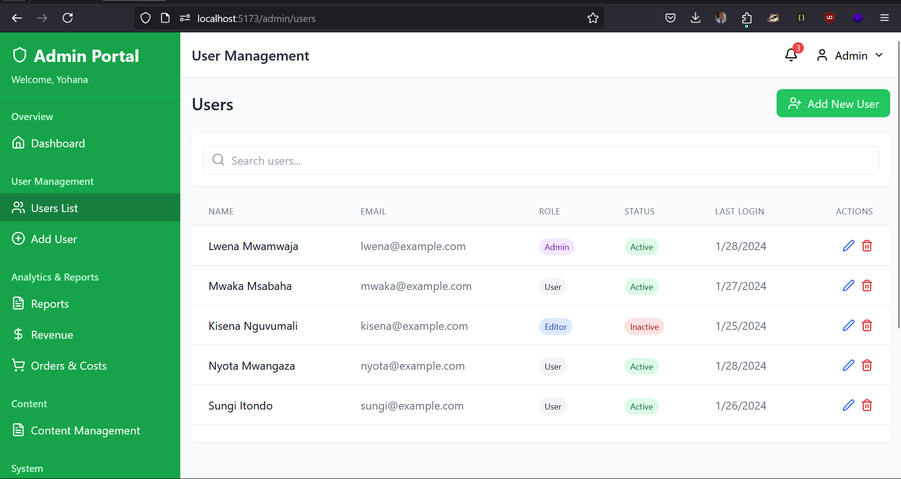

# **General Admin Dashboard**

A modern and reusable **Admin Dashboard** built with **React** and **Tailwind CSS**. This dashboard offers various administrative functionalities, including user management, system stats, reports, and more. The project leverages **React Router** for navigation and is designed to be scalable, flexible, and easy to integrate into any project.

---

## **Features**

### 1. **User Management**

- Add, edit, and delete users.
- View user details and perform CRUD operations.
- Role-based access control (Admin, Manager, User).
- Search, filter, and paginate through user lists.

### 2. **System Stats & KPIs**

- Display KPIs like total users, active users, and revenue.
- Real-time data updates for system stats.
- Interactive charts and graphs for data visualization.

### 3. **Reports**

- View various reports related to users, orders, revenue, etc.
- Export and download reports as needed.

### 4. **Messages & Notifications**

- View and manage system messages.
- Message details and conversation threads.
- Support for real-time notifications.

### 5. **Audit Logs**

- Track and display user activities, such as logins, actions taken, and errors.
- View and filter audit logs by user, action type, or date range.

### 6. **Profile Management**

- View and edit user profiles.
- Profile settings for admins, users, and managers.
- Ability to update profile information.

### 7. **Content Management**

- Manage content such as posts, articles, and other media.
- View content details and edit as needed.

### 8. **Revenue & Orders Cost Dashboard**

- View real-time revenue statistics.
- Analyze and track orders cost.

### 9. **Settings & Support**

- Configure application settings (site name, theme, etc.).
- Access support resources for troubleshooting.

---

## **Tech Stack**

- **Frontend**:
  - **React** (for component-based UI)
  - **Tailwind CSS** (for responsive and customizable styling)
  - **React Router** (for navigation)
- **Backend**: N/A (This project is a front-end dashboard; backend can be integrated with APIs later.)
- **Deployment**:
  - Can be deployed using **Vercel**, **Netlify**, or any static hosting platform.

---

## **Setup Instructions**

### **1. Clone the repository:**

   ```bash
   git clone https://github.com/Njoxpy/dashboard
   cd frontend
   ```

### **2. Install dependencies:**

   ```bash
   npm install
   ```

### **3. Run the development server:**

   ```bash
   npm run dev
   ```

   This will start the development server, and you can view the dashboard at `http://localhost:5000/admin`.

---

## **Routing Structure** (React Router)

The dashboard utilizes **React Router** to manage navigation within the admin interface. Below is the routing setup:

### **Routes:**

```jsx
const router = createBrowserRouter(
  createRoutesFromElements(
    <Route>
      <Route path="admin/*" element={<DashboardLayout />}>
        <Route index element={<DashboardOverview />} />
        <Route path="users">
          <Route index element={<UsersPage />} />
          <Route path=":id" element={<UserDetailsPage />} />
          <Route path="create" element={<AddUserPage />} />
        </Route>
        <Route path="dashboard" element={<DashboardOverview />} />
        <Route path="reports" element={<ReportsPage />} />
        <Route path="revenue" element={<RevenueDashboard />} />
        <Route path="contents" element={<ContentDashboard />} />
        <Route path="contents/:id" element={<ContentDetails />} />
        <Route path="messages" element={<Messages />} />
        <Route path="messages/:id" element={<MessageDetail />} />
        <Route path="settings" element={<Settings />} />
        <Route path="support" element={<Support />} />
        <Route path="logs" element={<AuditLogs />} />
        <Route path="profile" element={<ProfilePage />} />
        <Route path="profile/edit" element={<EditProfilePage />} />
        <Route path="Orders-Cost" element={<OrdersCostDashboard />} />
        <Route path="*" element={<NotFound />} />
      </Route>
    </Route>
  )
);
```

### **Explanation of the Routes**

- **`DashboardLayout`**: The main layout for the dashboard that contains the sidebar, top bar, and dynamic content area.
- **`DashboardHome`, `UsersPage`, `ReportsPage`, etc.**: These are individual pages/components representing sections of the admin dashboard.
- **`AddUserPage`, `UserDetailsPage`, `EditProfilePage`, etc.**: Pages for adding/editing users, viewing user details, and updating user profiles.
- **Dynamic Routes**: The routes like `users/:id` and `messages/:id` handle dynamic user or message details.
- **404 Route (`NotFound`)**: A fallback route for when a user navigates to a non-existent page.

---

## **How to Contribute**

If you'd like to contribute to this project, follow these steps:

1. Fork the repository.
2. Clone your fork to your local machine.
3. Create a new branch for your feature or fix.
4. Implement your changes.
5. Commit your changes with descriptive messages.
6. Push your branch to your forked repository.
7. Open a pull request.

---

### **Future Improvements**

- **Backend Integration**: Integrating a backend API for real-time data updates (e.g., users, messages, and audit logs).
- **Authentication**: Implementing user authentication for managing users and admin access.
- **Advanced Analytics**: Adding more complex charts, data filters, and user statistics.
- **Multilingual Support**: Adding support for multiple languages to serve a global audience.

---

### **Acknowledgements**

This dashboard was created with the help of **React** and **Tailwind CSS**, along with **React Router** for navigation. The goal was to create a highly reusable, flexible admin dashboard that can easily be customized and deployed.

---

Thanks for the clarification! If your images are located in the `./frontend/src/assets/` folder, you will need to update the paths in the `README` to reflect this.

Here's the updated section with the correct image paths:

---

## **Project Screenshots**

Here are some images of the dashboard in action:

### 1. **Add User Page**



### 2. **Loading Screen**



### 3. **Main Dashboard**



### 4. **Messages Section**



### 5. **Reports Page**



### 6. **Support Page**



### 7. **Users Page**



---
